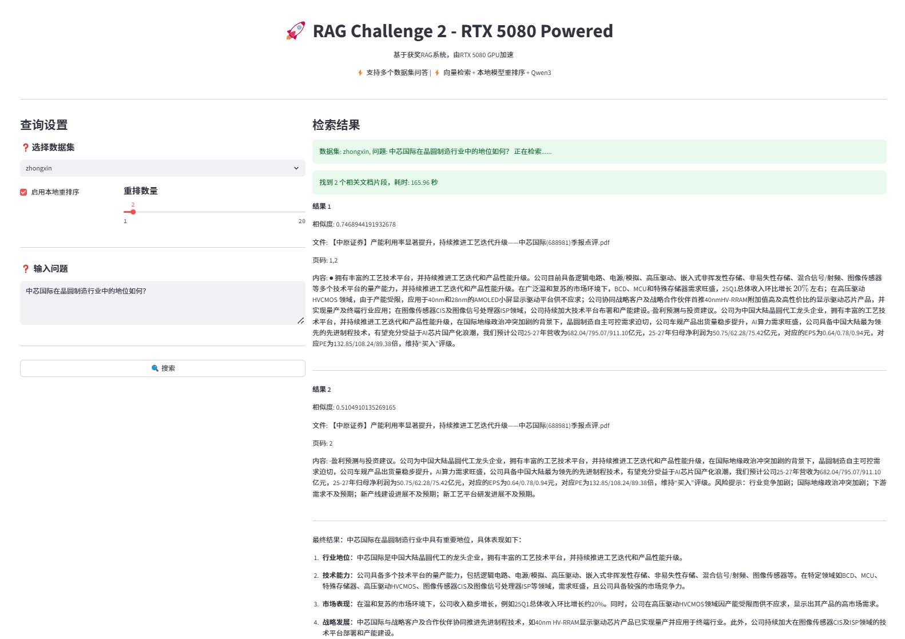

# RAG Challenge 2 - RTX 5080 Powered

这是一个基于检索增强生成（RAG）系统的项目，旨在提供一个高效的文档问答解决方案。该系统利用向量检索、本地模型重排序以及Qwen3大模型，并可通过Streamlit构建的图形用户界面进行交互。

## 项目简介

本项目是“RAG Challenge 2”的实现，旨在展示一个高性能的RAG系统。它能够处理多个数据集，通过先进的检索技术（如向量检索和本地模型重排序）从文档中提取相关信息，并结合Qwen3大模型生成高质量的回答。系统还提供了一个用户友好的Web界面，方便用户进行查询和查看结果。

## 功能特性

- **多数据集支持**：能够处理和查询不同的文档数据集（例如：`zhongxin`）。
- **向量检索**：利用文档嵌入进行高效的相似性搜索。
- **本地模型重排序**：通过本地模型对检索结果进行二次排序，提高相关性。
- **Qwen3大模型集成**：利用Qwen3模型生成最终的答案。
- **Streamlit GUI**：提供直观的Web界面进行交互式查询。
- **文档解析与嵌入**：`main.py` 负责解析指定路径下的文档并生成嵌入。

## 项目结构

```
rag_qwen3/
├── documents/                  # 存放原始文档
│   └── zhongxin/
│       └── 中芯国际机构调研纪要.pdf
├── parsed_documents/           # 存放解析后的文档和嵌入数据
│   ├── *.json
├── src/                        # 核心功能代码
│   ├── dashscope_processor.py  # 处理DashScope相关的逻辑
│   ├── document_parser.py      # 文档解析模块
│   ├── pipeline.py             # RAG管道的核心逻辑
│   ├── utils.py                # 常用工具函数
│   └── vector_processor.py     # 向量处理模块
├── gui.py                      # Streamlit图形用户界面入口
├── main.py                     # 文档处理和嵌入的主入口
└── static/
    └── images/
        └── rag_result.png      # 示例图片
```

## 安装与使用

### 1. 环境准备

确保您的系统安装了Python 3.10+。

### 2. 克隆项目

```bash
git clone <项目仓库地址>
cd rag_qwen3
```

### 3. 安装依赖

建议使用 `pip` 安装所有必要的Python库。您可能需要创建一个 `requirements.txt` 文件来列出所有依赖。

```bash
pip install -r requirements.txt
```

（**注意**：当前项目缺少 `requirements.txt` 文件，请根据 `src` 目录下的代码和 `gui.py` 中的 `streamlit` 导入自行安装依赖，例如 `streamlit`, `dashscope` 等。）

### 4. 文档处理与嵌入

运行 `main.py` 来解析您的文档并生成向量嵌入。默认情况下，它会处理 `documents/zhongxin` 目录下的PDF文件。

```bash
python main.py
```

### 5. 启动图形用户界面

运行 `gui.py` 启动Streamlit应用。应用将在您的浏览器中打开。

```bash
streamlit run gui.py
```

### 6. 进行查询

在Streamlit界面中，您可以选择数据集、输入查询问题，并选择是否启用本地模型重排序。点击“搜索”按钮即可查看检索结果和最终答案。


## 许可证

[根据您的项目选择合适的许可证，例如 MIT, Apache 2.0 等]